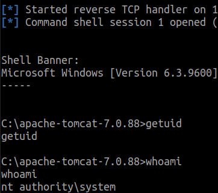

# Jerry (HackTheBox)

## Severity Critical: Default Credentials on Apache Tomcat Web Server

An Apache Tomcat web server located on the Jerry machine was found to have the default admin credential login `tomcat:s3cret` giving full access to an outside attacker to the management console. Apache Tomcat is designed to allow rapid deployment of web applications under intended usage. However, using the admin access, attackers can upload a malicious web app giving them full access to the underlying machine and compromising the network.

Using the network scanning tool "nmap", the target host was found to have an open port `8080` running `Apache Tomcat/7.0.88`. Accessing the web interface led to a login prompt for authentication. Testing common default credentials revealed `tomcat:s3cret` as the admin login. The admin login provides access to the `/manager` tab where a malicious WAR file generated with a tool such as `msfvenom` can be uploaded ultimately giving root shell access to the attacker.

### Remediation

In order to prevent attacks from occurring on the Apache server, it is recommended to change the default admin credentials to a strong password with complexity requirements. Additionally, access to the `/manager` console should be properly delegated or removed to prevent unauthorized uploads of WAR files. Detailed information about securely configuring Apache Tomcat Manager can be found at https://tomcat.apache.org/tomcat-7.0-doc/manager-howto.html
