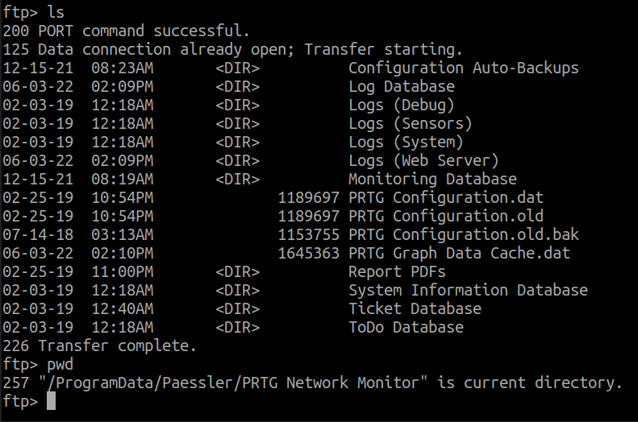
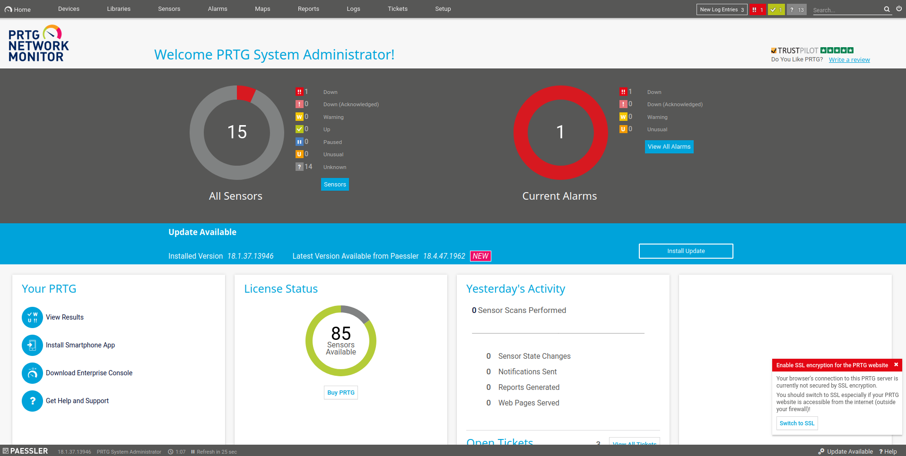

# Netmon (HackTheBox)

## Severity High: Anonymous FTP in Root Directory

An anonymously accessible FTP server was found running in the root directory on the Netmon machine. Allowing public read access to the root directory can result in compromised data and data loss such as important internal client information or data being used directly by another service. In this scenario the FTP access was used to retrieve sensitive user data and discover a password to another service (PRTG Network Monitor) saved in plaintext.

Using the network scanning tool "nmap", the target host was revealed to have an open port `21` running `Microsoft ftpd` with anonymous login allowed. The nmap scan further revealed the accessible directory as the root `C:\` windows directory which contains all the files used by the operating system. Logging into the FTP server allowed the unauthenticated downloading of various files the FTP server user had access to. Access included the `Public` user as well as important configuration files for programs, notably PRTG Network Monitor.

### Remediation

To prevent unauthorized access to the FTP server, it is recommended to enable password authentication for all connections as well as upgrade to SFTP or FTPS to ensure all connections remain encrypted. Furthermore, the FTP server should be reconfigured with appropriate permissions to allow access to a dedicated directory to prevent users or attackers from gaining access to the rest of the file system. Information regarding IIS's FTP service configuration and security can be found at https://winscp.net/eng/docs/guide_windows_ftps_server.

## Severity High: Plaintext Password Saved in PRTG Network Monitor Configuration [Vulnerability](https://www.paessler.com/about-prtg-17-4-35-through-18-1-37)

Using access from the anonymous FTP login described above, configuration files for the PRTG Network Monitor (netmon) were found which contained the web login password for the admin account. Due to a known vulnerability in netmon versions 17.4.35 through 18.1.37, netmon may leave plaintext passwords in its configuration files after initial setup. Plaintext passwords can easily allow attackers to gain unauthorized access to critical services and take control of important client information.

Using access to the file system through the previously described FTP server, the user can traverse to `C:\ProgramData\Paessler\PRTG Network Monitor` which contains configuration files for netmon. The `PRTG Configuration.old` file in particular is vulnerable to password leaks. Downloading the file reveals a node `<dbpassword>` which contains the originally set password of `PrTg@dmin2018`. Probing the Webmin login page with variations reveals the new password has been set to `PrTg@dmin2019`, a poor password update.  

### Remediation

To prevent future password leaks from netmon, it is recommended to update netmon to the latest version and apply any security updates published by Paessler. To cleanup any existing passwords in netmon, it is recommended to delete `Configuration Auto-Backups`, `PRTG Configuration.old`, and `PRTG Configuration.nul` in the `C:\ProgramData\Paessler\PRTG Network Monitor` directory. Further information about the password leak vulnerability and proper mitigation can be found at https://www.paessler.com/about-prtg-17-4-35-through-18-1-37. 

It is also recommended to apply a comprehensive password policy to ensure passwords are not reused or slightly altered to match password expiration requirements.

## Severity Critical: CVE-2018-9276 PRTG Authenticated Remote Code Execution

A PRTG Network Monitor (netmon) web page was discovered running on the target host with an outdated version and known RCE vulnerability. The netmon web page allows authenticated users to manage network traffic and signal data, but it can also be abused by an attacker to gain root access to the target machine. Attackers can utilize the RCE exploit to gain full access to the machine compromising the network and any devices connected to it.

Using the network scanning tool "nmap", the target host was revealed to have an open port `80` running `Indy httpd 18.1.37.13946` which was revealed to tbe the netmon management web page. Using credentials discovered from the described netmon plaintext vulnerability, access is gained to the webpage and underlying service. The particular version is shown to fall under RCE CVE-2018-9276 and an exploit from the "Metasploit" framework is used to spawn in a root shell on the target machine.

